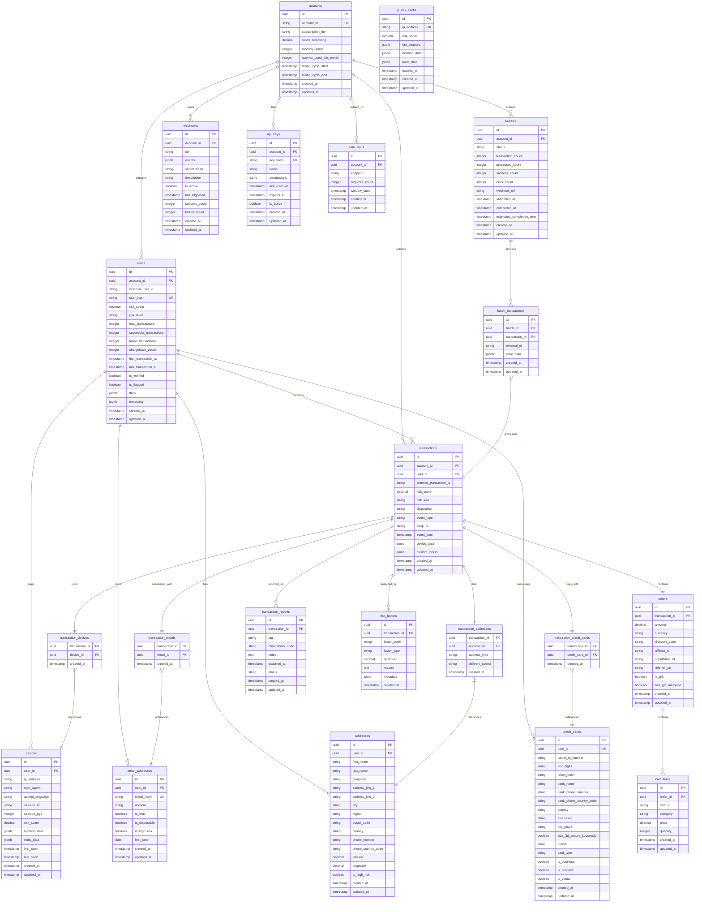

```mermaid
erDiagram
    accounts {
        uuid id PK
        string account_id UK
        string subscription_tier
        decimal funds_remaining
        integer monthly_quota
        integer queries_used_this_month
        timestamp billing_cycle_start
        timestamp billing_cycle_end
        timestamp created_at
        timestamp updated_at
    }

    users {
        uuid id PK
        uuid account_id FK
        string external_user_id
        string user_hash UK
        decimal risk_score
        string risk_level
        integer total_transactions
        integer successful_transactions
        integer failed_transactions
        integer chargeback_count
        timestamp first_transaction_at
        timestamp last_transaction_at
        boolean is_verified
        boolean is_flagged
        jsonb flags
        jsonb metadata
        timestamp created_at
        timestamp updated_at
    }

    transactions {
        uuid id PK
        uuid account_id FK
        uuid user_id FK
        string external_transaction_id
        decimal risk_score
        string risk_level
        string disposition
        string event_type
        string shop_id
        timestamp event_time
        jsonb device_data
        jsonb custom_inputs
        timestamp created_at
        timestamp updated_at
    }

    devices {
        uuid id PK
        uuid user_id FK
        string ip_address
        string user_agent
        string accept_language
        string session_id
        integer session_age
        decimal risk_score
        jsonb location_data
        jsonb traits_data
        timestamp first_seen
        timestamp last_seen
        timestamp created_at
        timestamp updated_at
    }

    transaction_devices {
        uuid transaction_id FK
        uuid device_id FK
        timestamp created_at
    }

    email_addresses {
        uuid id PK
        uuid user_id FK
        string email_hash UK
        string domain
        boolean is_free
        boolean is_disposable
        boolean is_high_risk
        date first_seen
        timestamp created_at
        timestamp updated_at
    }

    transaction_emails {
        uuid transaction_id FK
        uuid email_id FK
        timestamp created_at
    }

    addresses {
        uuid id PK
        uuid user_id FK
        string first_name
        string last_name
        string company
        string address_line_1
        string address_line_2
        string city
        string region
        string postal_code
        string country
        string phone_number
        string phone_country_code
        decimal latitude
        decimal longitude
        boolean is_high_risk
        timestamp created_at
        timestamp updated_at
    }

    transaction_addresses {
        uuid transaction_id FK
        uuid address_id FK
        string address_type
        string delivery_speed
        timestamp created_at
    }

    credit_cards {
        uuid id PK
        uuid user_id FK
        string issuer_id_number
        string last_digits
        string token_hash
        string bank_name
        string bank_phone_number
        string bank_phone_country_code
        string country
        string avs_result
        string cvv_result
        boolean was_3d_secure_successful
        string brand
        string card_type
        boolean is_business
        boolean is_prepaid
        boolean is_virtual
        timestamp created_at
        timestamp updated_at
    }

    transaction_credit_cards {
        uuid transaction_id FK
        uuid credit_card_id FK
        timestamp created_at
    }

    orders {
        uuid id PK
        uuid transaction_id FK
        decimal amount
        string currency
        string discount_code
        string affiliate_id
        string subaffiliate_id
        string referrer_uri
        boolean is_gift
        boolean has_gift_message
        timestamp created_at
        timestamp updated_at
    }

    cart_items {
        uuid id PK
        uuid order_id FK
        string item_id
        string category
        decimal price
        integer quantity
        timestamp created_at
        timestamp updated_at
    }

    transaction_reports {
        uuid id PK
        uuid transaction_id FK
        string tag
        string chargeback_code
        text notes
        timestamp occurred_at
        string status
        timestamp created_at
        timestamp updated_at
    }

    batches {
        uuid id PK
        uuid account_id FK
        string status
        integer transaction_count
        integer processed_count
        integer success_count
        integer error_count
        string webhook_url
        timestamp submitted_at
        timestamp completed_at
        timestamp estimated_completion_time
        timestamp created_at
        timestamp updated_at
    }

    batch_transactions {
        uuid id PK
        uuid batch_id FK
        uuid transaction_id FK
        string external_id
        jsonb error_data
        timestamp created_at
        timestamp updated_at
    }

    webhooks {
        uuid id PK
        uuid account_id FK
        string url
        jsonb events
        string secret_hash
        string description
        boolean is_active
        timestamp last_triggered
        integer success_count
        integer failure_count
        timestamp created_at
        timestamp updated_at
    }

    api_keys {
        uuid id PK
        uuid account_id FK
        string key_hash UK
        string name
        jsonb permissions
        timestamp last_used_at
        timestamp expires_at
        boolean is_active
        timestamp created_at
        timestamp updated_at
    }

    rate_limits {
        uuid id PK
        uuid account_id FK
        string endpoint
        integer requests_count
        timestamp window_start
        timestamp created_at
        timestamp updated_at
    }

    risk_factors {
        uuid id PK
        uuid transaction_id FK
        string factor_code
        string factor_type
        decimal multiplier
        text reason
        jsonb metadata
        timestamp created_at
    }

    ip_risk_cache {
        uuid id PK
        string ip_address UK
        decimal risk_score
        jsonb risk_reasons
        jsonb location_data
        jsonb traits_data
        timestamp expires_at
        timestamp created_at
        timestamp updated_at
    }

    accounts ||--o{ users : "contains"
    accounts ||--o{ transactions : "submits"
    accounts ||--o{ batches : "creates"
    accounts ||--o{ webhooks : "owns"
    accounts ||--o{ api_keys : "has"
    accounts ||--o{ rate_limits : "subject_to"
    
    users ||--o{ transactions : "performs"
    users ||--o{ devices : "uses"
    users ||--o{ email_addresses : "owns"
    users ||--o{ addresses : "has"
    users ||--o{ credit_cards : "possesses"
    
    transactions ||--|| transaction_devices : "uses"
    transactions ||--|| transaction_emails : "associated_with"
    transactions ||--|| transaction_addresses : "has"
    transactions ||--|| transaction_credit_cards : "pays_with"
    transactions ||--|| orders : "contains"
    transactions ||--o{ transaction_reports : "reported_as"
    transactions ||--o{ risk_factors : "analyzed_by"
    
    transaction_devices }|--|| devices : "references"
    transaction_emails }|--|| email_addresses : "references"
    transaction_addresses }|--|| addresses : "references"
    transaction_credit_cards }|--|| credit_cards : "references"
    
    orders ||--o{ cart_items : "contains"
    
    batches ||--o{ batch_transactions : "includes"
    batch_transactions }|--|| transactions : "processes"
```