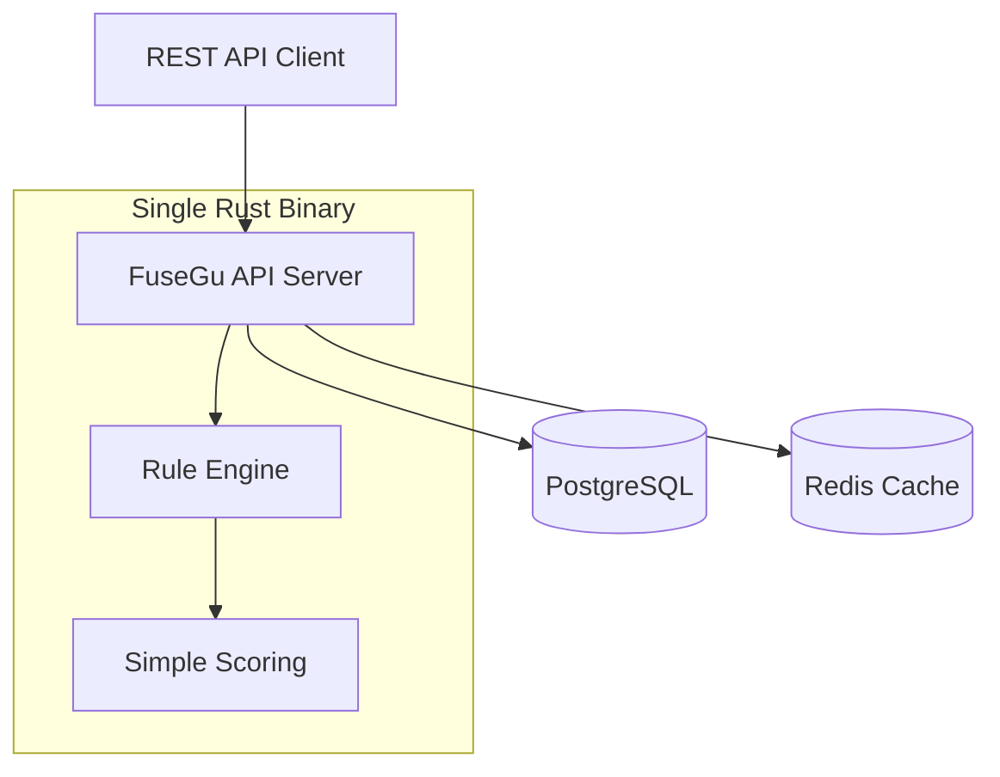
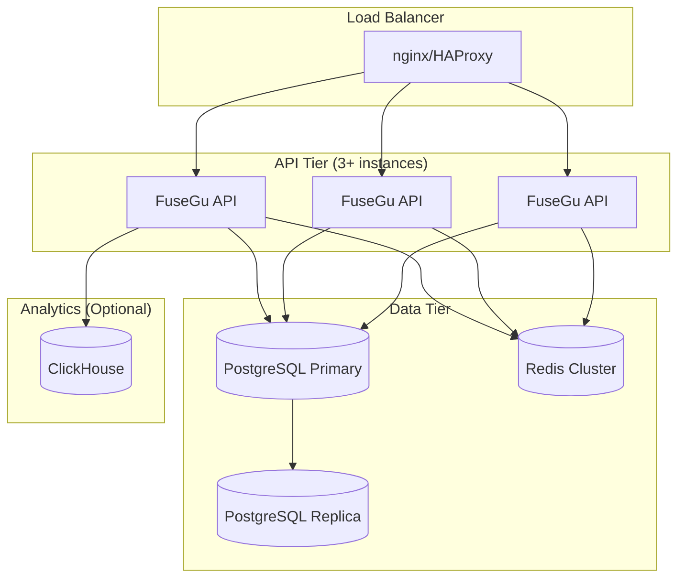
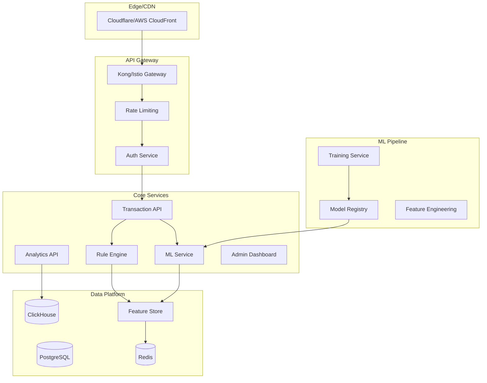

# Plan v2: MVP-First Approach

## 🎯 Revised Philosophy: Start Simple, Scale Smart

**Core Principle**: Build the simplest possible fraud detection system that provides real value, then iterate based on user feedback.

---

## 🥇 Phase 1: MVP (Months 1-3)
### Goal: Deployable fraud detection that beats "no fraud detection"

### Architecture: Monolith + PostgreSQL + Redis


### Core Features
1. **Single REST Endpoint**: `POST /v1/score`
2. **Basic Rule Engine**: 10-15 hardcoded fraud patterns
3. **Simple Scoring**: Weighted rule combinations (no ML)
4. **PostgreSQL**: Transaction logs + rule configs
5. **Redis**: IP/email velocity counters only

### Rule Engine v1: Rust Enums (No DSL)
```rust
#[derive(Debug, Clone)]
pub enum FraudRule {
    HighVelocityIP { window_minutes: u32, threshold: u32 },
    SuspiciousEmailDomain { domains: Vec<String> },
    LargeAmount { threshold: f64 },
    GeoMismatch { max_distance_km: f64 },
    NewUserHighAmount { days_threshold: u32, amount_threshold: f64 },
}

impl FraudRule {
    pub async fn evaluate(&self, txn: &Transaction, store: &FeatureStore) -> Option<RuleHit> {
        match self {
            FraudRule::HighVelocityIP { window_minutes, threshold } => {
                let count = store.get_ip_count(&txn.ip, *window_minutes).await?;
                if count > *threshold {
                    Some(RuleHit { 
                        rule: "high_velocity_ip",
                        score: 25.0,
                        reason: format!("IP {} had {} transactions in {}min", txn.ip, count, window_minutes)
                    })
                } else { None }
            }
            // ... other rules
        }
    }
}
```

### Simplified API Response
```json
{
  "transaction_id": "txn_123",
  "risk_score": 23.5,
  "risk_level": "medium",
  "disposition": "review",
  "rule_hits": [
    {
      "rule": "high_velocity_ip", 
      "score": 15.0,
      "reason": "IP 1.2.3.4 had 12 transactions in 60min"
    },
    {
      "rule": "suspicious_email",
      "score": 8.5, 
      "reason": "Email domain 10minutemail.com is disposable"
    }
  ],
  "processing_time_ms": 23
}
```

### Success Criteria
- [ ] Handles 1,000 RPS on single instance
- [ ] p99 latency < 200ms
- [ ] 15+ basic fraud rules implemented
- [ ] Docker deployment under 100MB
- [ ] OpenAPI docs auto-generated
- [ ] Basic Grafana dashboard

---

## 🚀 Phase 2: Production Ready (Months 4-6)
### Goal: Enterprise-deployable with advanced features

### Enhanced Architecture


### New Features
1. **YAML Rule Configuration**: User-definable rules
2. **Basic ML**: XGBoost model for score calibration
3. **Analytics Dashboard**: Basic metrics and trends
4. **Batch Processing**: Handle bulk uploads
5. **Webhook Notifications**: Real-time alerts
6. **Multi-tenancy**: API key scoping

### YAML Rule DSL v1
```yaml
# Simple, focused rule syntax
name: "High Risk Email Domain"
enabled: true
priority: 100

condition:
  field: "email.domain"
  operator: "in"
  values: ["10minutemail.com", "guerrillamail.com", "mailinator.com"]

action:
  score: 15.0
  reason: "Email from disposable domain"
  tags: ["email_risk", "disposable"]

# Velocity rule
name: "IP Velocity"
condition:
  field: "device.ip_address"
  operator: "velocity"
  window: "1h"
  threshold: 10

action:
  score: 25.0
  reason: "High transaction velocity from IP"
```

### Success Criteria
- [ ] Handles 5,000 RPS across cluster
- [ ] p99 latency < 100ms
- [ ] User-configurable rules via API
- [ ] Basic ML model improves accuracy by 10%+
- [ ] Helm chart for Kubernetes deployment
- [ ] Comprehensive monitoring/alerting

---

## 🌟 Phase 3: Advanced Platform (Months 7-12)
### Goal: Competitive with commercial offerings

### Full Platform Architecture


### Advanced Features
1. **Sophisticated ML**: Ensemble models, deep learning
2. **Advanced Rule Engine**: Complex expressions, time-based rules
3. **Real-time Feature Store**: Sub-millisecond feature lookups
4. **Advanced Analytics**: Fraud trends, model performance tracking
5. **A/B Testing**: Champion/challenger model deployment
6. **Enterprise Features**: SSO, RBAC, audit logs

---

## 📋 Revised Technology Choices

### Phase 1 Stack (Minimal)
```toml
# Cargo.toml - Keep it simple
[dependencies]
axum = "0.7"
tokio = { version = "1.0", features = ["full"] }
sqlx = { version = "0.7", features = ["postgres", "runtime-tokio-rustls"] }
redis = { version = "0.24", features = ["tokio-comp"] }
serde = { version = "1.0", features = ["derive"] }
uuid = { version = "1.0", features = ["v4"] }
chrono = { version = "0.4", features = ["serde"] }
utoipa = { version = "4.0", features = ["axum_extras"] }
tracing = "0.1"
thiserror = "1.0"
```

### Phase 2 Additions
```toml
# Add ML and configuration
smartcore = "0.3"      # Basic ML algorithms
serde_yaml = "0.9"     # Rule configuration
jsonschema = "0.17"    # Rule validation
```

### Phase 3 Additions  
```toml
# Advanced ML and analytics
ort = "1.16"           # ONNX Runtime
polars = "0.35"        # DataFrames
clickhouse = "0.11"    # ClickHouse client
```

---

## 🎯 Success Metrics by Phase

### Phase 1 (MVP)
- **Technical**: 1K RPS, <200ms p99, 99% uptime
- **Functional**: 15+ rules, basic scoring works
- **Adoption**: 10+ early users, 100+ GitHub stars

### Phase 2 (Production)
- **Technical**: 5K RPS, <100ms p99, 99.9% uptime  
- **Functional**: User-defined rules, basic ML
- **Adoption**: 100+ users, 1000+ GitHub stars, first enterprise customer

### Phase 3 (Platform)
- **Technical**: 20K RPS, <50ms p99, 99.99% uptime
- **Functional**: Advanced ML, real-time features
- **Business**: Revenue positive, strong community

---

## 🔒 Security-First Approach

### Built-in Security (All Phases)
1. **API Security**: Rate limiting, input validation, CORS
2. **Data Security**: Encryption at rest/transit, PII tokenization
3. **Access Control**: API key scoping, role-based permissions
4. **Audit**: All actions logged with immutable audit trail
5. **Compliance**: GDPR deletion, data export, retention policies

### Security Testing
```rust
#[cfg(test)]
mod security_tests {
    #[tokio::test]
    async fn test_sql_injection_protection() {
        // Ensure parameterized queries prevent injection
    }
    
    #[tokio::test] 
    async fn test_rate_limiting() {
        // Verify rate limits are enforced
    }
    
    #[tokio::test]
    async fn test_pii_tokenization() {
        // Ensure PII is properly tokenized
    }
}
```

This revised plan focuses on building something real and deployable quickly, then iterating based on actual user needs rather than trying to build everything at once.