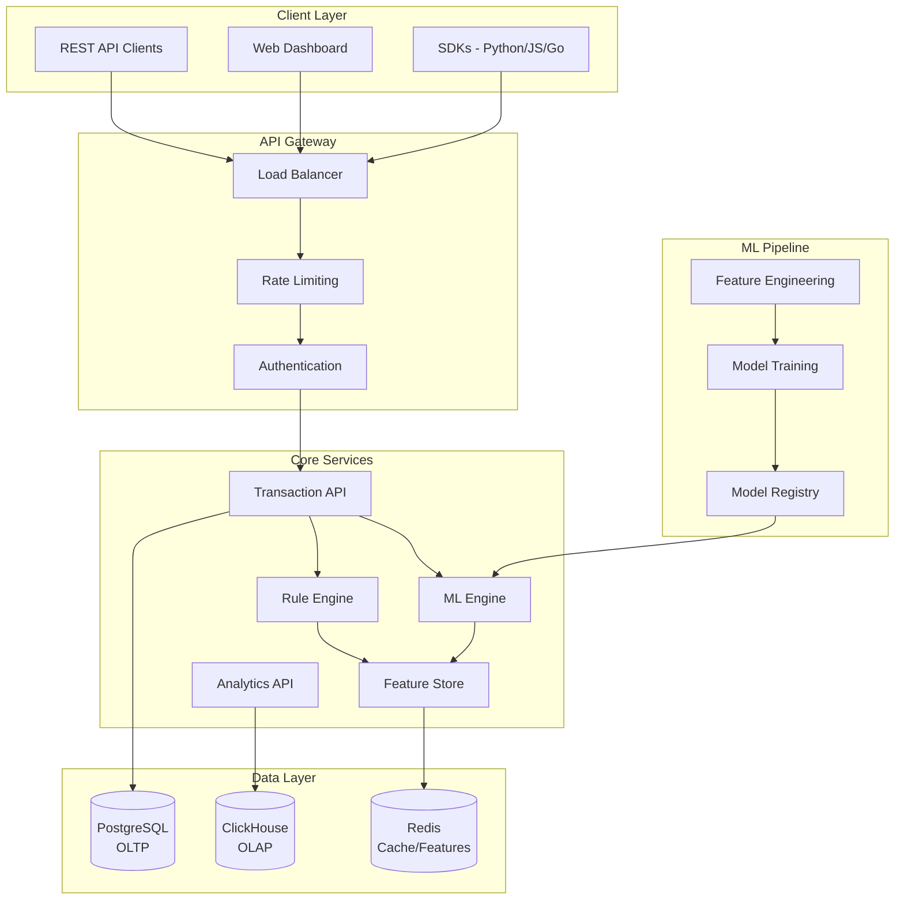
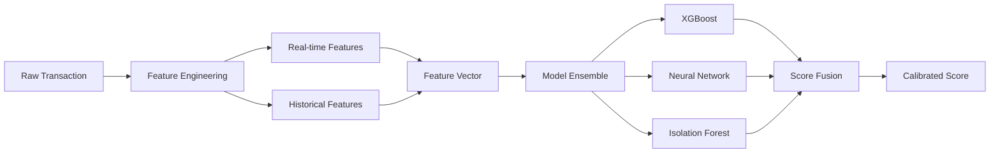

I'll create a comprehensive plan for your open source MinFraud clone that improves upon the ChatGPT-o3 design. Let me build a cleaner, more focused architecture.

# FuseGu: Open Source Fraud Detection Platform

## 🎯 Project Overview

**FuseGu** is a high-performance, open-source fraud detection platform built in Rust that provides real-time transaction risk assessment through a combination of rule-based and ML-powered detection engines.

### Target Industries & Use Cases

| Industry | Fraud Scenarios |
|----------|----------------|
| **Digital Commerce** | Payment fraud, account takeover, policy abuse |
| **Finance & Fintech** | Money movement, chargeback fraud, account creation |
| **Online Gambling** | Bonus abuse, multiple accounts, payment fraud |
| **Travel & Transportation** | Booking fraud, loyalty program abuse |
| **Food & Delivery** | Promo abuse, fake accounts, payment disputes |
| **Internet & Software** | Account takeover, content scams, subscription fraud |

---

## 🏗️ Core Architecture



---

## 📊 Data Architecture

### OLTP (PostgreSQL)
```sql
-- Core transaction storage
transactions
├── Real-time transaction data
├── User accounts and metadata
├── Rule configurations
├── API keys and authentication
└── Audit logs

-- Optimized for:
├── High-frequency writes (10K+ TPS)
├── Real-time lookups
├── ACID compliance
└── Sub-100ms response times
```

### OLAP (ClickHouse)
```sql
-- Analytics and historical data
events_fact
├── Denormalized transaction events
├── Feature vectors and scores
├── Model predictions and outcomes
├── Time-series aggregations
└── Reporting datasets

-- Optimized for:
├── Analytical queries
├── Time-series analysis
├── Aggregations and rollups
└── Historical trend analysis
```

### Feature Store (Redis)
```redis
-- Real-time features
velocity:ip:{ip}:1h      # IP transaction velocity
velocity:email:{hash}:24h # Email velocity counters
device:{fingerprint}     # Device characteristics
geo:ip:{ip}             # IP geolocation cache
rules:compiled          # Compiled rule cache
```

---

## 🚀 API Design

### Core Endpoints

#### 1. Transaction Scoring
```http
POST /v1/transactions
Content-Type: application/json

{
  "device": {
    "ip_address": "198.51.100.1",
    "user_agent": "Mozilla/5.0...",
    "session_id": "sess_abc123"
  },
  "event": {
    "type": "purchase",
    "transaction_id": "txn_123456",
    "time": "2025-01-13T10:30:00Z"
  },
  "order": {
    "amount": 199.99,
    "currency": "USD"
  },
  "email": {
    "address": "user@example.com"
  },
  "billing": {
    "country": "US",
    "postal": "10001"
  }
}
```

**Response:**
```http
HTTP/1.1 201 Created
Content-Type: application/json

{
  "id": "550e8400-e29b-41d4-a716-446655440000",
  "risk_score": 15.42,
  "risk_level": "low",
  "disposition": "accept",
  "created_at": "2025-01-13T10:30:00.123Z",
  "rule_scores": {
    "ip_velocity": 2.1,
    "email_domain": 0.5,
    "amount_threshold": 0.0
  },
  "ml_score": 12.82,
  "factors": [
    {
      "code": "NEW_EMAIL_DOMAIN",
      "weight": 1.5,
      "message": "Email domain first seen recently"
    }
  ],
  "_links": {
    "self": "/v1/transactions/550e8400-e29b-41d4-a716-446655440000",
    "insights": "/v1/transactions/550e8400-e29b-41d4-a716-446655440000/insights"
  }
}
```

#### 2. Batch Processing
```http
POST /v1/transactions/batch
Content-Type: application/json

{
  "transactions": [...],
  "webhook_url": "https://api.yoursite.com/webhooks/batch-complete"
}
```

#### 3. Rule Management
```http
GET /v1/rules
POST /v1/rules
PUT /v1/rules/{rule_id}
DELETE /v1/rules/{rule_id}
```

#### 4. Feedback & Reporting
```http
POST /v1/transactions/{id}/reports
{
  "tag": "chargeback",
  "chargeback_code": "4837",
  "occurred_at": "2025-01-20T09:15:00Z"
}
```

---

## 🔧 Rule Engine

### Rule Definition Language (YAML)
```yaml
# rules/high_velocity_ip.yaml
name: "High IP Velocity"
version: "1.2.0"
description: "Detect high transaction velocity from single IP"
enabled: true
priority: 100

conditions:
  - field: "device.ip_address"
    operator: "velocity"
    params:
      window: "1h"
      threshold: 10
      
  - field: "order.amount"
    operator: "greater_than"
    value: 100

actions:
  - type: "score"
    value: 25.0
    reason: "High velocity from IP address"
    
  - type: "flag"
    name: "velocity_risk"
```

### Advanced Rule Features
```yaml
# Complex rule with multiple conditions
name: "Suspicious Email Pattern"
conditions:
  - any_of:
    - field: "email.domain"
      operator: "in_list"
      value: ["10minutemail.com", "guerrillamail.com"]
    - field: "email.address"
      operator: "regex"
      pattern: "^[a-z]+[0-9]{3,}@"
      
  - field: "billing.country"
    operator: "not_equals"
    value_from: "device.geo.country"

# Time-based rules
schedule:
  timezone: "UTC"
  active_hours: "09:00-23:00"
  active_days: ["MON", "TUE", "WED", "THU", "FRI"]
```

### Rule Engine Architecture
```rust
// Core rule engine implementation
pub struct RuleEngine {
    rules: Vec<CompiledRule>,
    feature_store: Arc<FeatureStore>,
    metrics: RuleMetrics,
}

impl RuleEngine {
    pub async fn evaluate(&self, transaction: &Transaction) -> RuleResult {
        let mut total_score = 0.0;
        let mut triggered_rules = Vec::new();
        
        for rule in &self.rules {
            if let Some(result) = rule.evaluate(transaction, &self.feature_store).await? {
                total_score += result.score;
                triggered_rules.push(result);
            }
        }
        
        RuleResult {
            total_score,
            triggered_rules,
            evaluation_time: start.elapsed(),
        }
    }
}
```

---

## 🤖 ML Engine

### Model Architecture


### Feature Engineering Pipeline
```rust
#[derive(Debug, Clone)]
pub struct FeatureVector {
    // Velocity features
    pub ip_1h_count: f32,
    pub ip_24h_count: f32,
    pub email_7d_count: f32,
    pub card_30d_count: f32,
    
    // Amount features
    pub amount_zscore: f32,
    pub amount_percentile: f32,
    
    // Geographic features
    pub ip_country_risk: f32,
    pub billing_shipping_distance: f32,
    
    // Device features
    pub device_risk_score: f32,
    pub user_agent_risk: f32,
    
    // Behavioral features
    pub session_length: f32,
    pub time_since_last_txn: f32,
}

impl FeatureVector {
    pub async fn from_transaction(
        txn: &Transaction,
        feature_store: &FeatureStore,
    ) -> Result<Self> {
        // Real-time feature computation
        let velocity_features = feature_store.get_velocity_features(&txn.device.ip_address).await?;
        let geo_features = feature_store.get_geo_features(&txn.device.ip_address).await?;
        
        // Combine all features
        Ok(FeatureVector {
            ip_1h_count: velocity_features.ip_1h,
            ip_24h_count: velocity_features.ip_24h,
            // ... other features
        })
    }
}
```

### Model Training Pipeline
```python
# training/pipeline.py
class FraudModelPipeline:
    def __init__(self):
        self.feature_store = ClickHouseFeatureStore()
        self.models = {
            'xgboost': XGBClassifier(),
            'neural_net': MLPClassifier(),
            'isolation_forest': IsolationForest(),
        }
    
    def train(self, start_date: str, end_date: str):
        # 1. Extract features from ClickHouse
        df = self.feature_store.get_training_data(start_date, end_date)
        
        # 2. Feature engineering
        X, y = self.prepare_features(df)
        
        # 3. Train ensemble
        trained_models = {}
        for name, model in self.models.items():
            trained_models[name] = model.fit(X, y)
        
        # 4. Calibrate scores
        calibrator = IsotonicRegression()
        ensemble_scores = self.ensemble_predict(X, trained_models)
        calibrator.fit(ensemble_scores, y)
        
        # 5. Export to ONNX
        self.export_onnx(trained_models, calibrator)
```

### Real-time Inference
```rust
pub struct MLEngine {
    xgboost_session: ort::Session,
    neural_net_session: ort::Session,
    isolation_forest_session: ort::Session,
    calibrator: IsotonicCalibrator,
}

impl MLEngine {
    pub async fn predict(&self, features: &FeatureVector) -> Result<MLPrediction> {
        // Convert to ONNX input
        let input = features.to_onnx_tensor()?;
        
        // Run ensemble models in parallel
        let (xgb_score, nn_score, if_score) = tokio::try_join!(
            self.xgboost_session.run(vec![input.clone()]),
            self.neural_net_session.run(vec![input.clone()]),
            self.isolation_forest_session.run(vec![input])
        )?;
        
        // Ensemble fusion
        let raw_score = 0.5 * xgb_score + 0.3 * nn_score + 0.2 * if_score;
        
        // Calibrate final score
        let calibrated_score = self.calibrator.predict(raw_score)?;
        
        Ok(MLPrediction {
            score: calibrated_score,
            model_scores: ModelScores {
                xgboost: xgb_score,
                neural_net: nn_score,
                isolation_forest: if_score,
            },
            feature_importance: self.compute_shap_values(&input)?,
        })
    }
}
```

---

## 🔒 Security & Compliance

### Authentication & Authorization
```rust
// Multi-layered auth system
pub enum AuthMethod {
    ApiKey { key: String, scopes: Vec<Scope> },
    OAuth2 { token: String, claims: Claims },
    HMAC { signature: String, timestamp: u64 },
}

pub enum Scope {
    TransactionWrite,
    TransactionRead,
    RuleWrite,
    RuleRead,
    AnalyticsRead,
    FeedbackWrite,
}
```

### Data Privacy & GDPR
```rust
#[derive(Debug, Clone)]
pub struct PrivacyConfig {
    pub encryption_key: String,
    pub tokenization_enabled: bool,
    pub retention_days: u32,
    pub anonymization_rules: Vec<AnonymizationRule>,
}

// Automatic PII handling
impl Transaction {
    pub fn anonymize(&mut self, config: &PrivacyConfig) {
        // Hash email addresses
        if let Some(email) = &mut self.email {
            email.address = hash_email(&email.address, &config.encryption_key);
        }
        
        // Tokenize IP addresses
        if config.tokenization_enabled {
            self.device.ip_address = tokenize_ip(&self.device.ip_address);
        }
    }
}
```

---

## 📈 Performance & Scalability

### Performance Targets
| Metric | Target | Measurement |
|--------|--------|-------------|
| **Latency** | p99 < 100ms | End-to-end scoring |
| **Throughput** | 10,000 RPS | Peak sustained load |
| **Availability** | 99.9% | Monthly uptime |
| **Rule Evaluation** | < 5ms | Per rule execution |
| **ML Inference** | < 10ms | Feature + prediction |

### Caching Strategy
```rust
pub struct CacheStrategy {
    // L1: In-memory LRU cache
    memory_cache: Arc<Mutex<LruCache<String, CachedResult>>>,
    
    // L2: Redis distributed cache
    redis_cache: RedisPool,
    
    // L3: ClickHouse materialized views
    analytics_cache: ClickHousePool,
}

impl CacheStrategy {
    pub async fn get_or_compute<F, T>(&self, key: &str, compute_fn: F) -> Result<T>
    where
        F: FnOnce() -> BoxFuture<'static, Result<T>>,
        T: Clone + Serialize + DeserializeOwned,
    {
        // Try L1 cache first
        if let Some(cached) = self.memory_cache.lock().unwrap().get(key) {
            return Ok(cached.clone());
        }
        
        // Try L2 cache
        if let Ok(cached) = self.redis_cache.get::<T>(key).await {
            self.memory_cache.lock().unwrap().put(key.to_string(), cached.clone());
            return Ok(cached);
        }
        
        // Compute and cache
        let result = compute_fn().await?;
        self.store_in_all_levels(key, &result).await?;
        Ok(result)
    }
}
```

---

## 🛠️ Implementation Roadmap

### Phase 1: Foundation (Months 1-2)
- [ ] **Core API Framework**
  - Axum-based REST API with OpenAPI docs
  - PostgreSQL schema and migrations
  - Redis connection pooling
  - Basic authentication (API keys)

- [ ] **Transaction Scoring**
  - Transaction ingestion endpoint
  - Basic risk scoring (rule-based only)
  - Response caching
  - Rate limiting

- [ ] **Developer Experience**
  - Docker Compose dev environment
  - API documentation with examples
  - Basic monitoring (metrics + logs)

### Phase 2: Rule Engine (Months 2-3)
- [ ] **Rule Definition System**
  - YAML-based rule configuration
  - Rule validation and testing
  - Hot-reload capability
  - Version control integration

- [ ] **Advanced Rule Features**
  - Velocity calculations
  - Geolocation lookups
  - Time-based conditions
  - Rule priority and chaining

- [ ] **Feature Store**
  - Redis-based feature caching
  - Real-time counter updates
  - Feature versioning
  - TTL management

### Phase 3: ML Engine (Months 3-4)
- [ ] **Model Infrastructure**
  - ONNX model loading
  - Feature engineering pipeline
  - Ensemble prediction
  - Score calibration

- [ ] **Training Pipeline**
  - ClickHouse integration
  - Python training scripts
  - Model validation
  - A/B testing framework

- [ ] **Advanced ML Features**
  - SHAP explainability
  - Drift detection
  - Automated retraining
  - Champion/challenger models

### Phase 4: Analytics & Reporting (Months 4-5)
- [ ] **Analytics Dashboard**
  - Real-time metrics
  - Historical trends
  - Rule performance
  - Model accuracy tracking

- [ ] **Advanced Analytics**
  - ClickHouse OLAP queries
  - Custom report generation
  - Data export capabilities
  - Compliance reporting

- [ ] **Feedback Loop**
  - Chargeback reporting
  - False positive tracking
  - Model improvement suggestions
  - Performance optimization

### Phase 5: Production Ready (Months 5-6)
- [ ] **Scalability & Performance**
  - Horizontal pod autoscaling
  - Database connection pooling
  - Response time optimization
  - Load testing validation

- [ ] **Security & Compliance**
  - GDPR compliance features
  - Audit logging
  - Data encryption
  - Security scanning

- [ ] **Operational Excellence**
  - Helm charts for deployment
  - Prometheus monitoring
  - Grafana dashboards
  - Alert management

---

## 🔧 Technology Stack

### Core Services
```rust
// Primary dependencies
axum = "0.7"           // Web framework
tokio = "1.0"          // Async runtime
sqlx = "0.7"           // Database toolkit
redis = "0.24"         // Redis client
utoipa = "4.0"         // OpenAPI generation
serde = "1.0"          // Serialization
uuid = "1.0"           // UUID generation
chrono = "0.4"         // Date/time handling
```

### ML & Analytics
```rust
// ML dependencies
ort = "1.16"           // ONNX Runtime
ndarray = "0.15"       // N-dimensional arrays
linfa = "0.7"          // ML toolkit
smartcore = "0.3"      // ML algorithms
candle = "0.4"         // Neural networks
```

### Infrastructure
```yaml
# docker-compose.yml
version: '3.8'
services:
  postgres:
    image: postgres:16
    environment:
      POSTGRES_DB: fusegu
      POSTGRES_USER: fusegu
      POSTGRES_PASSWORD: password
    
  redis:
    image: redis:7-alpine
    command: redis-server --appendonly yes
    
  clickhouse:
    image: clickhouse/clickhouse-server:latest
    environment:
      CLICKHOUSE_DB: analytics
      CLICKHOUSE_USER: fusegu
      CLICKHOUSE_PASSWORD: password
```

---

## 📋 Success Metrics

### Technical KPIs
- **Latency**: p50 < 20ms, p99 < 100ms
- **Throughput**: 10,000+ transactions/second
- **Availability**: 99.9% uptime
- **Error Rate**: < 0.1% 4xx/5xx responses

### Business KPIs
- **Detection Rate**: > 95% fraud detection
- **False Positive Rate**: < 2%
- **Rule Coverage**: 100+ pre-built rules
- **Model Accuracy**: > 90% AUC score

### Adoption Metrics
- **API Usage**: 1M+ API calls/month
- **Community**: 1000+ GitHub stars
- **Documentation**: 95%+ API coverage
- **Performance**: < 5 second deployment time

This plan provides a solid foundation for building a production-ready fraud detection platform that can compete with commercial solutions while remaining open source and community-driven.