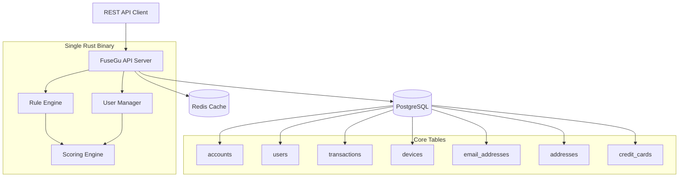
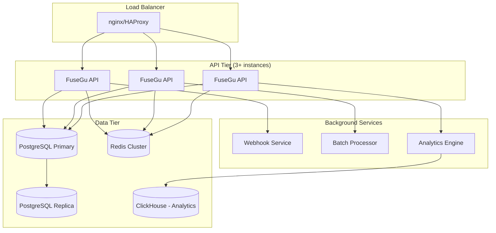

# Plan v3: Comprehensive Fraud Detection Platform

## 🎯 Refined Philosophy: Build Complete, Scale Smart

**Core Principle**: Build a comprehensive fraud detection platform that leverages the full power of cross-transaction user analysis while maintaining clean, phased development.

**Key Differentiator**: User-centric fraud detection with comprehensive cross-transaction risk analysis, not just individual transaction scoring.

---

## 🥇 Phase 1: MVP with User-Centric Foundation (Months 1-3)
### Goal: Core fraud detection with user tracking that beats basic solutions

### Architecture: Monolith + PostgreSQL + Redis


### Core Features (MVP)
1. **Transaction Risk Assessment**: Full `POST /v3/transactions` endpoint
2. **User Management**: User creation, lookup, and basic risk profiling
3. **Cross-Transaction Analysis**: Basic user behavioral patterns
4. **Multi-tenant Architecture**: Account management with API keys
5. **Device Fingerprinting**: IP analysis and device tracking
6. **Basic Rule Engine**: 15-20 hardcoded fraud patterns
7. **Simple Scoring**: Weighted rule combinations with user context

### Enhanced Rule Engine v1: User-Aware Fraud Rules
```rust
#[derive(Debug, Clone)]
pub enum FraudRule {
    // IP-based rules
    HighVelocityIP { window_minutes: u32, threshold: u32 },
    AnonymousIP { risk_multiplier: f64 },
    
    // Email-based rules  
    DisposableEmail { domains: Vec<String> },
    HighRiskEmailDomain { domains: Vec<String> },
    
    // User behavioral rules
    NewUserHighAmount { days_threshold: u32, amount_threshold: f64 },
    UserVelocity { window_hours: u32, transaction_threshold: u32, amount_threshold: f64 },
    UserDeviceChange { suspicion_multiplier: f64 },
    UserLocationJump { max_distance_km: f64 },
    
    // Transaction pattern rules
    LargeAmount { threshold: f64 },
    GeoMismatch { max_distance_km: f64 },
    CreditCardMismatch { country_mismatch: bool },
    
    // Address-based rules
    HighRiskBillingCountry { countries: Vec<String> },
    BillingShippingMismatch { max_distance_km: f64 },
}

impl FraudRule {
    pub async fn evaluate(&self, ctx: &RuleContext) -> Option<RuleHit> {
        match self {
            FraudRule::UserVelocity { window_hours, transaction_threshold, amount_threshold } => {
                if let Some(user) = &ctx.user {
                    let recent_txns = ctx.store.get_user_transaction_count(user.id, *window_hours).await?;
                    let recent_amount = ctx.store.get_user_transaction_amount(user.id, *window_hours).await?;
                    
                    if recent_txns > *transaction_threshold || recent_amount > *amount_threshold {
                        Some(RuleHit {
                            rule: "user_velocity",
                            score: 35.0,
                            reason: format!("User {} had {} transactions (${:.2}) in {}h", 
                                user.external_user_id.as_deref().unwrap_or("unknown"), 
                                recent_txns, recent_amount, window_hours)
                        })
                    } else { None }
                } else { None }
            }
            // ... other rules
        }
    }
}

#[derive(Debug)]
pub struct RuleContext<'a> {
    pub transaction: &'a TransactionRequest,
    pub user: Option<&'a User>,
    pub device: Option<&'a Device>, 
    pub store: &'a FeatureStore,
}
```

### API v1 Implementation (Aligned with OpenAPI spec)
```rust
// Core endpoints for Phase 1
#[derive(OpenApi)]
#[openapi(
    paths(
        create_transaction,
        get_transaction,
        list_transactions,
        create_user,
        get_user,
        list_users,
        get_account
    ),
    components(schemas(TransactionRequest, TransactionResponse, UserRequest, UserResponse))
)]
pub struct ApiDoc;

// Key endpoints to implement:
// POST /v3/transactions - Core transaction scoring
// GET /v3/transactions/{id} - Transaction lookup
// GET /v3/transactions - Transaction listing with filters
// POST /v3/users - User creation
// GET /v3/users/{id} - User lookup  
// GET /v3/users - User listing
// GET /v3/account - Account info
```

### Database Implementation Priority
```sql
-- Phase 1: Core tables (must have)
-- ✅ accounts (multi-tenancy)
-- ✅ users (cross-transaction tracking) 
-- ✅ transactions (core data)
-- ✅ devices (device fingerprinting)
-- ✅ email_addresses (email analysis)
-- ✅ addresses (address verification)
-- ✅ credit_cards (payment analysis)
-- ✅ api_keys (authentication)

-- Phase 1: Junction tables
-- ✅ transaction_devices
-- ✅ transaction_emails  
-- ✅ transaction_addresses
-- ✅ transaction_credit_cards

-- Phase 1: Essential indexes for performance
CREATE INDEX CONCURRENTLY idx_users_account_external ON users(account_id, external_user_id);
CREATE INDEX CONCURRENTLY idx_transactions_user_created ON transactions(user_id, created_at);
CREATE INDEX CONCURRENTLY idx_devices_ip_seen ON devices(ip_address, last_seen);
```

### Success Criteria (Phase 1)
- [ ] **API Completeness**: Core transaction and user endpoints fully functional
- [ ] **Performance**: 1,000 RPS, p99 latency < 200ms
- [ ] **User Analytics**: Basic cross-transaction risk scoring working
- [ ] **Rule Coverage**: 20+ fraud rules including user behavioral patterns
- [ ] **Multi-tenancy**: Account isolation and API key authentication
- [ ] **Documentation**: Auto-generated OpenAPI docs matching specification
- [ ] **Deployment**: Docker deployment under 150MB with database migrations

---

## 🚀 Phase 2: Production Platform (Months 4-6)
### Goal: Enterprise-ready platform with advanced insights

### Enhanced Architecture


### New Features (Phase 2)
1. **Advanced Insights**: `/transactions/{id}/insights` endpoint (Pro tier)
2. **Risk Factors**: `/transactions/{id}/factors` endpoint (Enterprise tier)
3. **User Risk Analysis**: `/users/{id}/risk-analysis` with behavioral patterns
4. **Batch Processing**: Async bulk transaction processing
5. **Webhook System**: Real-time notifications for events
6. **Basic Analytics**: `/analytics` endpoint with trends and metrics
7. **YAML Rule Configuration**: Customer-defined rules
8. **Basic ML**: Score calibration and feature engineering
9. **Subscription Tiers**: Free/Pro/Enterprise with feature gating

### Advanced Database Features
```sql
-- Phase 2: Additional tables
-- ✅ batches & batch_transactions (bulk processing)
-- ✅ webhooks (notifications)
-- ✅ transaction_reports (feedback loop)
-- ✅ risk_factors (detailed analysis)
-- ✅ rate_limits (API throttling)
-- ✅ ip_risk_cache (performance)

-- Phase 2: Orders and cart analysis
-- ✅ orders (detailed order info)
-- ✅ cart_items (shopping cart analysis)

-- Phase 2: Advanced indexes
CREATE INDEX CONCURRENTLY idx_transactions_risk_score_desc ON transactions(account_id, risk_score DESC);
CREATE INDEX CONCURRENTLY idx_users_risk_flagged ON users(account_id, risk_level, is_flagged);
CREATE INDEX CONCURRENTLY idx_batches_status_submitted ON batches(account_id, status, submitted_at);
```

### ML Integration v1
```rust
// Basic ML for score calibration
use smartcore::ensemble::random_forest_regressor::*;

#[derive(Debug)]
pub struct ScoreCalibrator {
    model: Option<RandomForestRegressor<f64>>,
    feature_extractor: FeatureExtractor,
}

impl ScoreCalibrator {
    pub async fn calibrate_score(&self, raw_score: f64, features: &TransactionFeatures) -> f64 {
        if let Some(model) = &self.model {
            let feature_vec = self.feature_extractor.extract(features);
            model.predict(&feature_vec).unwrap_or(raw_score)
        } else {
            raw_score
        }
    }
}

#[derive(Debug)]
pub struct TransactionFeatures {
    pub user_transaction_count: u32,
    pub user_avg_amount: f64,
    pub device_seen_count: u32,
    pub ip_risk_score: f64,
    pub email_domain_risk: f64,
    // ... other features extracted from database
}
```

### Success Criteria (Phase 2)
- [ ] **Scale**: 5,000 RPS across cluster, p99 latency < 100ms
- [ ] **API Complete**: All major endpoints from OpenAPI spec implemented
- [ ] **Advanced Features**: Insights, factors, user analytics, batch processing
- [ ] **ML Integration**: Basic score calibration improving accuracy by 15%+
- [ ] **Production Ready**: Kubernetes deployment, monitoring, alerting
- [ ] **Revenue Ready**: Subscription tiers and billing integration
- [ ] **Enterprise Features**: Webhook system, advanced analytics

---

## 🌟 Phase 3: Advanced Intelligence Platform (Months 7-12)
### Goal: Industry-leading fraud detection with advanced ML

### Microservices Architecture
```mermaid
graph TB
    subgraph "Edge/CDN"
        A[Cloudflare/AWS CloudFront]
    end
    
    subgraph "API Gateway"
        B[Kong/Istio Gateway]
        C[Rate Limiting]
        D[Auth Service]
    end
    
    subgraph "Core Services"
        E[Transaction API]
        F[User Service]
        G[Rule Engine Service]
        H[ML Inference Service]
        I[Analytics Service]
        J[Admin Dashboard]
    end
    
    subgraph "Data Platform"
        K[(PostgreSQL Cluster)]
        L[(Redis Cluster)]
        M[(ClickHouse Cluster)]
        N[Feature Store (Redis)]
        O[ML Model Store]
    end
    
    subgraph "ML Pipeline"
        P[Feature Engineering]
        Q[Model Training]
        R[Model Registry]
        S[A/B Testing]
    end
    
    A --> B
    B --> C
    C --> D
    D --> E
    E --> F
    E --> G  
    E --> H
    H --> O
    I --> M
    P --> N
    Q --> R
    R --> O
    S --> H
```

### Advanced Features (Phase 3)
1. **Advanced ML Models**: Ensemble methods, deep learning, graph neural networks
2. **Real-time Feature Store**: Sub-millisecond feature lookups
3. **A/B Testing Platform**: Champion/challenger model deployment
4. **Advanced Analytics**: Comprehensive dashboards and insights
5. **Graph Analysis**: Entity relationship mapping and suspicious network detection
6. **Real-time Streaming**: Kafka-based event processing
7. **Advanced Rules**: Complex CEP (Complex Event Processing) patterns
8. **Enterprise Security**: SSO, RBAC, comprehensive audit logs

### Advanced ML Stack
```toml
# Advanced ML dependencies
ort = "1.16"              # ONNX Runtime for production models
tch = "0.13"              # PyTorch bindings for deep learning
candle = "0.3"            # Rust-native ML framework
polars = "0.35"           # High-performance DataFrames
arrow = "48.0"            # Columnar data processing
rdkafka = "0.34"          # Kafka integration for streaming
```

### Success Criteria (Phase 3)
- [ ] **Performance**: 20,000 RPS, p99 latency < 50ms
- [ ] **Intelligence**: Advanced ML models with 30%+ accuracy improvement
- [ ] **Enterprise**: SSO, RBAC, compliance features (SOC2, PCI DSS)
- [ ] **Platform**: Multi-region deployment, 99.99% uptime
- [ ] **Business**: Competitive with industry leaders (Sift, Kount, etc.)

---

## 📋 Updated Technology Stack

### Phase 1 Dependencies
```toml
[dependencies]
# Core framework
axum = "0.7"
tokio = { version = "1.0", features = ["full"] }
tower = "0.4"
tower-http = "0.5"

# Database
sqlx = { version = "0.7", features = ["postgres", "runtime-tokio-rustls", "uuid", "chrono"] }
redis = { version = "0.24", features = ["tokio-comp"] }

# Serialization & APIs
serde = { version = "1.0", features = ["derive"] }
serde_json = "1.0"
utoipa = { version = "4.0", features = ["axum_extras"] }
utoipa-swagger-ui = { version = "4.0", features = ["axum"] }

# Core utilities  
uuid = { version = "1.0", features = ["v4", "serde"] }
chrono = { version = "0.4", features = ["serde"] }
tracing = "0.1"
tracing-subscriber = "0.3"
thiserror = "1.0"
anyhow = "1.0"

# Security & validation
argon2 = "0.5"           # Password hashing
validator = "0.16"       # Input validation
```

### Phase 2 Additions
```toml
# ML and configuration
smartcore = "0.3"        # Basic ML algorithms
serde_yaml = "0.9"       # YAML rule configuration
jsonschema = "0.17"      # Rule validation
reqwest = "0.11"         # HTTP client for webhooks

# Background processing
tokio-cron-scheduler = "0.9"  # Scheduled tasks
```

### Phase 3 Additions
```toml
# Advanced ML and analytics  
ort = "1.16"             # ONNX Runtime
polars = "0.35"          # DataFrames
clickhouse = "0.11"      # ClickHouse client
rdkafka = "0.34"         # Kafka streaming
```

---

## 🎯 Refined Success Metrics

### Phase 1 (User-Centric MVP)
- **Technical**: 1K RPS, <200ms p99, 99% uptime
- **Functional**: 20+ rules with user context, cross-transaction analysis
- **Database**: Full schema implemented, proper indexes, <10ms query times
- **API**: Core endpoints matching OpenAPI spec
- **Adoption**: 10+ early users, 100+ GitHub stars

### Phase 2 (Production Platform)  
- **Technical**: 5K RPS, <100ms p99, 99.9% uptime
- **Functional**: Advanced insights, batch processing, webhooks, basic ML
- **Business**: Subscription tiers, first enterprise customer
- **ML**: Score calibration improving accuracy by 15%+
- **Adoption**: 100+ users, 1000+ GitHub stars

### Phase 3 (Advanced Platform)
- **Technical**: 20K RPS, <50ms p99, 99.99% uptime  
- **Intelligence**: Advanced ML with 30%+ accuracy improvement
- **Enterprise**: SOC2 compliance, multi-region deployment
- **Business**: Revenue positive, competitive positioning
- **Platform**: Industry-standard feature parity

---

## 🔗 Integration Points

### API-Database Alignment
- **User-Centric Design**: API endpoints leverage user table for cross-transaction analysis
- **Comprehensive Data Model**: All API request/response fields map to database schema
- **Performance Optimization**: Database indexes align with API query patterns
- **Feature Completeness**: Database supports all API features (insights, factors, analytics)

### Development Workflow
1. **Schema-First**: Database migrations drive API implementation
2. **API-First**: OpenAPI spec validates implementation completeness  
3. **Test-Driven**: Integration tests verify API-database consistency
4. **Performance-Monitored**: Real-world metrics validate design assumptions

This refined plan ensures the development phases align with the comprehensive API specification and robust database design, enabling true user-centric fraud detection from day one.